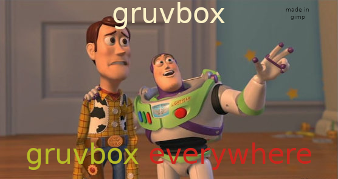

# fineman's dotfiles
  
Friendship ended with [Gruvbox Material](https://github.com/sainnhe/gruvbox-material). Now [Kanagawa](https://github.com/rebelot/kanagawa.nvim) is my best friend.

## Jump to
[Wallpaper sources](./.config/wallpapers/sources.md)

## TODO
### Configs - kanagawa
- [ ] [Firefox](https://hg.mozilla.org/mozilla-central/)
	- [ ] create own kanagawa theme with [Firefox Color](https://addons.mozilla.org/en-GB/firefox/addon/firefox-color/) as described in [Catpuccin Firefox repo](https://github.com/catppuccin/firefox) (those premade plugins have too high contrast for my liking)
- [ ] [kitty](https://github.com/kovidgoyal/kitty)
- [ ] [mako](https://github.com/emersion/mako)
	- [ ] maybe swaync would be better?
- [ ] [qutebrowser](https://github.com/qutebrowser/qutebrowser)
	-  [ ] create kanagawa theme
- [ ] [sway](https://github.com/swaywm/sway)
- [ ] zsh + [Oh My Zsh](https://github.com/ohmyzsh/ohmyzsh)
- [ ] [bemenu](https://github.com/Cloudef/bemenu) (via wrapper script)
- [ ] [waybar](https://github.com/Alexays/Waybar)
- [x] [hyprlock](https://github.com/hyprwm/hyprlock/)
- [x] [keyd](https://github.com/rvaiya/keyd)

### Scripts
- [ ] [bemenu-wrapper.sh](./.scripts/bemenu-wrapper.sh)
	- [ ] move cliphist to other location
- [ ] [bemenu-audio_switcher](./.scripts/audio_switcher.sh)
	- Broken since one of latest PipeWire udpates (unable to specify output's ports)
	- [ ] TODO start through bemenu-wrapper
- [ ] [create_symlinks.sh](./create_symlinks.sh)
	- [ ] check if in termux or linux desktop
- [ ] [sway_fedora_systemd_env.sh](./.scripts/sway_fedora_systemd_env.sh) - properly import session variables when starting sway through GDM
	- [ ] test SDL_GAMECONTROLLERCONFIG
- [ ] [update_everything.sh](./.scripts/update_everything.sh)
	- [ ] dnf
	- [ ] cargo
	- [ ] pipx
	- [ ] nvim plugins through lazy.nvim
	- [ ] termux package manager if termux env detected
	- [ ] proper checks
	- [ ] other pacmans I've installed through all those years
	- [ ] misc git repos
	- [x] update omz custom plugins
- [x] [play_pause_all.sh](./.scripts/play_pause_all.sh) - pause all players / start the most recent one
- [x] [progressbar.sh](./.scripts/progressbar.sh) - send notification with progressbar one volume/brightness change via notify-send
