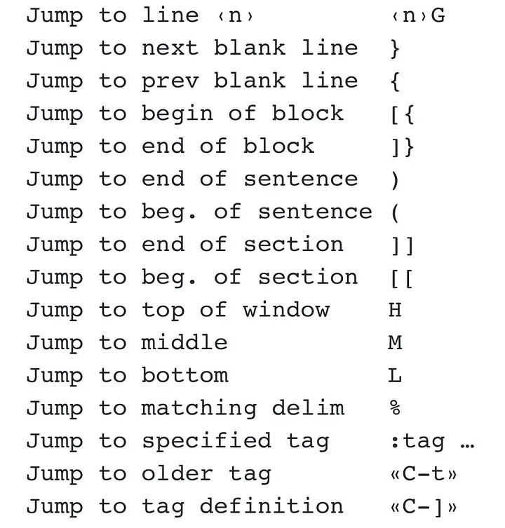

# ToC
- [Navigation](#navigation-fu)

# Navigation Fu
## Exiting modes
`esc` or `CTRL-[`

## Jumps
`CTRL-]` - From `:h CTRL-]`: Jump to the definition of the keyword under the cursor.  
e.g. jump to header as defined [markdown-main.md](../markdown/markdown-main.md#-internal-(headers)-links) (btw try it here).

### What counts as jumps:
The following commands are "jump" commands: "'", "\`", "G", "/", "?", "n", "N", "%", "(", ")", "\[\[", "\]\]", "{", "}", ":s", ":tag", "L", "M", "H" and the commands that start editing a new file. See `:h jump-motions`

### Prev/Next jump
- `n_CTRL-o` - previous jump (in normal mode)
- `n_CTRL-i` - next jump 
- `ng;` - jump to n-th older postion in jump list
- `ng,` - jump to n-th newer postion in jump list

## URL handling
`gf` - open file under cursor in neovim. Helpful in markdown.
`gx` - open link under cursor with default OS's handler (xdg-open in Linux), e.g. opens www link in browser.

# Folds
- `zM` - open all folds
- `zR` - close all folds

# Selection
## Misc. examples
- `yiw` - yank inside the word
- `yaw` - yank around the word - that one will include brackets, etc.

# Macros
Start recording with q  
Run with @  
Repeat latest with @@
